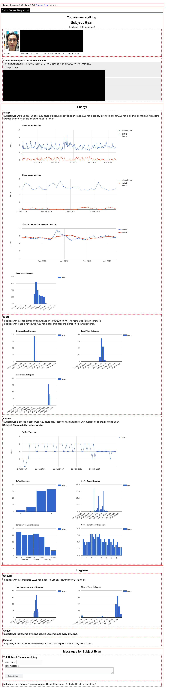
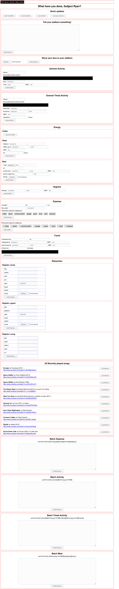

# Too Much Info

This appengine webapp allows you (well, me) to log arbitrary activities, with or without duration. This was started because I wanted to move my sleep log online from spreadsheets. It was 2012 and I just finished Udacity's web developer course.

It has been many years, and I only do minimal maintenance. It serves my purpose well enough at the moment. Maybe a new version someday?

## Usage

You will have to make an app on gcp and upload this repository.

Edit app.yaml.example and constants.py.example for your purpose.

## Signing up?

Yes, there is a sign up page. No, there will not be a beta key. This app can store sensitive information. I do not want yours.

## Public page?

It was disabled due to a bug involving a comment form and spam.

## Preview

Here are some preview pages in images:

**Private Page**
This is what you will see if you are signed in and go to a u/username page. Plots and stats of pre-selected activities.

**Panel**
This is where you record your activities. There is no in-app way to edit your entries; you must go to Google cloud console and find the datastore entry yourself.

